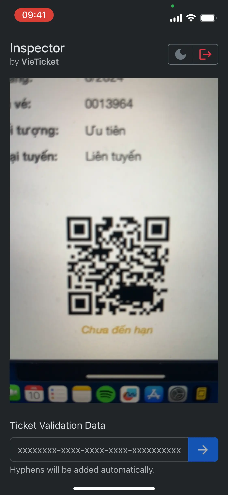
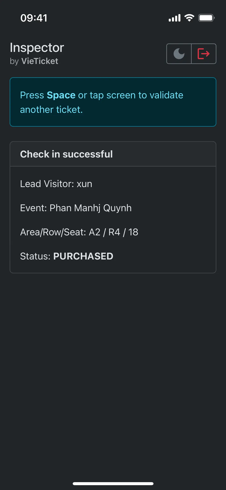

# Inspector by VieTicket

#### A streamlined e-ticket inspection <a href="https://developer.mozilla.org/en-US/docs/Web/Progressive_web_apps" target="_blank">Progressive Web App (PWA)</a> built with <a href="https://react.dev/" target="_blank">React</a>, designed to make event check-ins quick and efficient.

<p align="center">
  <a href="#key-features">Key Features</a> •
  <a href="#how-to-use">How To Use</a> •
  <a href="#why-inspector-by-vieticket">Why Inspector by Vieticket?</a> •
  <a href="#technical-highlights">Technical highlights</a> •
  <a href="#credits">Credits</a> •
  <a href="#license">License</a>
</p>

<div style="display: flex; flex-wrap: wrap; justify-content: space-between;">
  
  
</div>

## Key Features

* **Seamless QR Code Scanning:** Instantly check in attendees by scanning their QR code tickets. If scanning fails, manual ticket number entry is supported.
* **Informative Ticket Details:**  Clearly displays ticket validity status and relevant attendee information.
* **Light/Dark Mode:**  Choose your preferred visual theme, with an option to match your system's settings.
* **Fast load time:**  The app opens instantly, thanks to its PWA architecture.

## How To Use

1. **Prerequisites:** Ensure you have Git and Node.js installed.
2. **Clone & Install:**
   ```bash
   git clone [https://github.com/isoamyl50/vieticket-inspector-pwa.git](https://github.com/isoamyl50/vieticket-inspector-pwa.git)
   cd vieticket-inspector-pwa
   npm install
   ```
3. **Environment Setup:**
   - Create a `.env` file in the project root.
   - Add your API URL: `VITE_APP_API_BASE_URL=<API_URL>`
4. **Run:**
   ```bash
   npm start
   ```

## Why Inspector by VieTicket?

* **Speed:**  Focuses on fast, reliable ticket validation to keep lines moving.
* **Simplicity:** Intuitive interface minimizes training time for staff.
* **Flexibility:** Works on various devices.

## Technical Highlights

* Built with React for a modern, component-based approach.
* Leverages the power of PWAs for offline functionality and app-like experience.
* Utilizes libraries like `nimiq/qr-scanner` for optimized QR code handling.

## Credits

This software uses the following open source packages and projects:

- [TypeScript](https://www.typescriptlang.org/)
- [React](https://react.dev/)
- [Node.js](https://nodejs.org/)
- [nimiq/qr-scanner](https://github.com/nimiq/qr-scanner)
- [SurajanShrestha/qr-scanner-in-react](https://github.com/SurajanShrestha/qr-scanner-in-react)
- [workbox](https://developers.google.com/web/tools/workbox)
- [Vite](https://vitejs.dev/)
- [PWA Plugin for Vite](https://vite-pwa-org.netlify.app/)
- [react-bootstrap](https://react-bootstrap.netlify.app/)

and more.

## License

MIT

---

> GitHub [@isoamyl50](https://github.com/isoamyl50)
